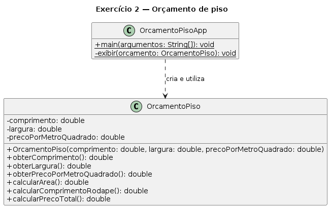
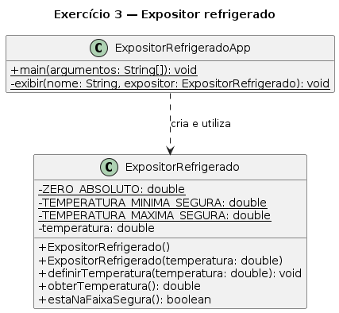
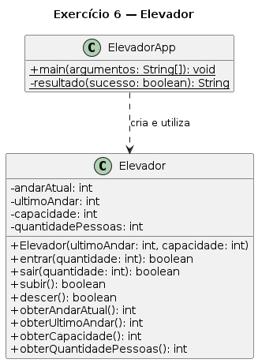
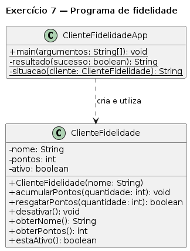
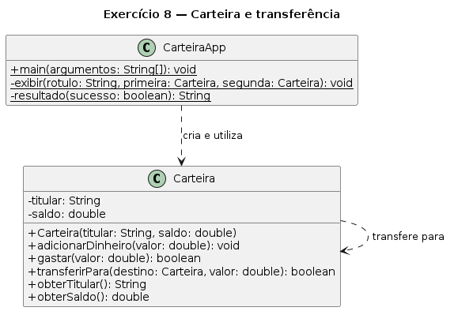
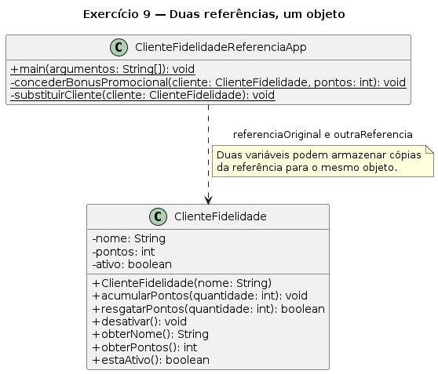

# Prática em sala — classes e objetos

Resolva os exercícios para praticar **abstração**, **classes**, **objetos** e **encapsulamento** em Java.

## Orientações

- Leia os requisitos de negócio antes de iniciar a implementação.
- Use o diagrama para identificar nomes, tipos e visibilidades.
- Mantenha as regras de negócio na classe do domínio, não na classe de aplicação.
- Preserve um estado válido ao construir e modificar objetos.
- Em cada exercício, use a classe `App` indicada para demonstrar operações válidas, inválidas e casos de fronteira.

## Parte I — classes, atributos e objetos

### 1. Iluminação de uma loja

Uma loja controla separadamente a iluminação de seus setores para evitar que áreas sem utilização permaneçam iluminadas.

#### Requisitos de negócio

- Cada iluminação deve identificar o setor e sua potência em watts.
- Para setor não informado, adote `"Setor não informado"`; para potência não positiva, adote `10.0 W`.
- Toda iluminação deve começar desligada e permitir operações para ligar e desligar.
- Alterar uma iluminação não deve afetar as demais.

#### Requisitos técnicos

Em `IluminacaoLojaApp`, represente a vitrine e o estoque, ligue somente a vitrine e apresente o estado de ambas.

**Conceitos principais:** classe, objeto, construtor, estado próprio e métodos de instância.

### 2. Orçamento de piso

Uma empresa de reformas precisa calcular a quantidade de piso e de rodapé necessária para ambientes retangulares, além do preço do material.

#### Requisitos de negócio

- Cada orçamento deve registrar comprimento, largura e preço por metro quadrado.
- Dimensões não positivas devem ser normalizadas para `1.0 m`; preço negativo, para zero.
- O orçamento deve informar a área, o comprimento do rodapé e o preço total.
- Os valores do orçamento não devem ser alterados depois de sua criação.

#### Requisitos técnicos

Em `OrcamentoPisoApp`, apresente um cômodo de `5.0 m × 3.0 m`, com piso a `R$ 80.00/m²`, e outro com uma dimensão inválida.

**Conceitos principais:** normalização de argumentos e métodos que produzem resultados.

### 3. Expositor refrigerado

Um mercado monitora expositores refrigerados que devem permanecer entre `2.0 °C` e `8.0 °C`.

#### Requisitos de negócio

- Um expositor criado sem temperatura informada deve iniciar em `4.0 °C`.
- Deve ser possível informar outra temperatura inicial.
- Quando a temperatura inicial for inferior ao zero absoluto (`-273.15 °C`), adote `4.0 °C`.
- Leituras posteriores inferiores ao zero absoluto devem ser ignoradas sem modificar o estado anterior.
- O expositor deve informar se está na faixa segura de conservação.

#### Requisitos técnicos

Em `ExpositorRefrigeradoApp`, demonstre uma leitura segura, outra fora da faixa, um ajuste válido e uma leitura fisicamente inválida.

**Conceitos principais:** sobrecarga, delegação com `this(...)` e preservação do estado.

## Parte II — encapsulamento e regras de negócio

### 4. Produto em estoque

Uma papelaria precisa controlar entradas e retiradas de produtos sem permitir inconsistências no estoque.

#### Requisitos de negócio

- Todo produto deve possuir nome, preço unitário e quantidade disponível.
- Para nome não informado, adote `"Produto sem nome"`; preços ou quantidades iniciais negativas devem ser normalizados para zero.
- Entradas devem aceitar somente quantidades positivas.
- Uma retirada exige quantidade positiva e estoque suficiente.
- Uma operação recusada não deve alterar o estoque.
- A quantidade não pode ser alterada diretamente por código externo.

#### Requisitos técnicos

Em `ProdutoApp`, demonstre uma entrada, uma retirada válida e uma retirada maior que o estoque disponível.

**Conceitos principais:** abstração, encapsulamento, invariante `quantidade >= 0` e métodos de negócio.

### 5. Ingresso de cinema

Um cinema precisa impedir que o mesmo ingresso seja vendido mais de uma vez e aplicar corretamente a meia-entrada.

#### Requisitos de negócio

- Cada ingresso deve identificar o filme e o preço da entrada inteira.
- Para título não informado, adote `"Filme não informado"`; preço não positivo deve ser normalizado para `1.0`.
- Todo ingresso deve começar disponível.
- A primeira venda deve marcar o ingresso como vendido e devolver o valor cobrado.
- A meia-entrada custa metade do preço da entrada inteira.
- Novas tentativas de venda devem ser recusadas sem alterar o estado.

#### Requisitos técnicos

Em `IngressoCinemaApp`, venda um ingresso de meia-entrada e tente vendê-lo novamente.

**Conceitos principais:** abstração, transição de estado e proteção de regras pelo objeto.

### 6. Elevador

Um edifício precisa controlar a movimentação e a ocupação de seu elevador, respeitando seus limites físicos.

#### Requisitos de negócio

- O edifício deve possuir ao menos um andar acima do térreo e o elevador deve admitir ao menos uma pessoa.
- Valores não positivos para último andar ou capacidade devem ser normalizados para `1`.
- O elevador deve começar vazio e no térreo.
- A entrada não pode ultrapassar a capacidade e a saída não pode superar a ocupação.
- Quantidades não positivas devem ser recusadas.
- O elevador não pode ultrapassar o último andar nem descer abaixo do térreo.
- Operações recusadas não devem alterar o estado.

#### Requisitos técnicos

Em `ElevadorApp`, demonstre os limites de lotação, térreo e último andar, usando laços quando apropriado.

**Conceitos principais:** invariantes, controle de estado, seleção e iteração.

### 7. Programa de fidelidade

Uma empresa oferece pontos aos clientes cadastrados e permite utilizá-los em benefícios.

#### Requisitos de negócio

- Para nome não informado, adote `"Cliente não identificado"`.
- Todo cliente deve começar sem pontos e com cadastro ativo.
- Somente quantidades positivas podem ser acumuladas.
- Um resgate exige cadastro ativo e pontos suficientes.
- Um resgate recusado não deve alterar a pontuação.
- Depois da desativação, não é possível acumular nem resgatar pontos.

#### Requisitos técnicos

Em `ClienteFidelidadeApp`, demonstre acúmulo, resgate válido, resgate sem saldo e uma operação após a desativação.

**Conceitos principais:** identidade, independência entre objetos e comportamento condicionado ao estado.

## Parte III — referências e colaboração

### 8. Carteira e transferência

Uma carteira digital deve controlar o saldo de seu titular e permitir transferências seguras.

#### Requisitos de negócio

- Para titular não informado, adote `"Sem nome"`; saldo inicial negativo deve ser normalizado para zero.
- Somente valores positivos podem ser adicionados ou gastos.
- Um gasto não pode ultrapassar o saldo disponível.
- Uma transferência exige destino existente, diferente da própria carteira, e saldo suficiente.
- Uma transferência recusada não deve modificar nenhuma carteira.
- O saldo não pode ser alterado diretamente por código externo.

#### Requisitos técnicos

Em `CarteiraApp`, demonstre uma transferência válida, outra sem saldo suficiente e outra sem carteira de destino.

**Conceitos principais:** colaboração entre objetos, `this`, encapsulamento e parâmetros de tipos por referência.

### 9. Duas referências, um cliente

Uma promoção credita pontos em um cliente já cadastrado. O sistema precisa considerar quando variáveis e parâmetros alcançam o mesmo objeto.

#### Requisitos de negócio

- Um bônus promocional deve atualizar o cadastro recebido pelo método.
- A atualização deve ser observada por qualquer variável que alcance o mesmo cliente.
- Substituir apenas o parâmetro local por outro cliente não deve trocar a referência mantida pelo chamador.

#### Requisitos técnicos

Em `ClienteFidelidadeReferenciaApp`, use `referenciaOriginal` e `outraReferencia` para o mesmo cliente, conceda um bônus e demonstre o efeito de reatribuir somente um parâmetro.

**Conceitos principais:** compartilhamento de referências e passagem por valor de uma referência.

### 10. Máquina de vendas

Uma máquina de vendas deve receber pagamentos, liberar produtos disponíveis e devolver o crédito não utilizado.

#### Requisitos de negócio

- Cada máquina deve informar produto, preço, estoque e crédito inserido.
- Para produto não informado, adote `"Produto não informado"`; preço não positivo deve ser normalizado para `1.0` e estoque negativo para zero.
- Somente valores positivos podem ser inseridos.
- Uma compra exige estoque e crédito suficientes.
- Uma compra realizada deve reduzir uma unidade e descontar o preço do crédito.
- Uma compra recusada não deve alterar estoque nem crédito.
- O cancelamento deve devolver todo o crédito e zerá-lo.

#### Requisitos técnicos

Em `MaquinaVendasApp`, implemente um menu para inserir dinheiro, comprar, cancelar e encerrar. Ao encerrar, devolva o crédito restante. Demonstre compras sem crédito e sem estoque.

**Conceitos principais:** modelagem completa, encapsulamento, invariantes, seleção e iteração.
