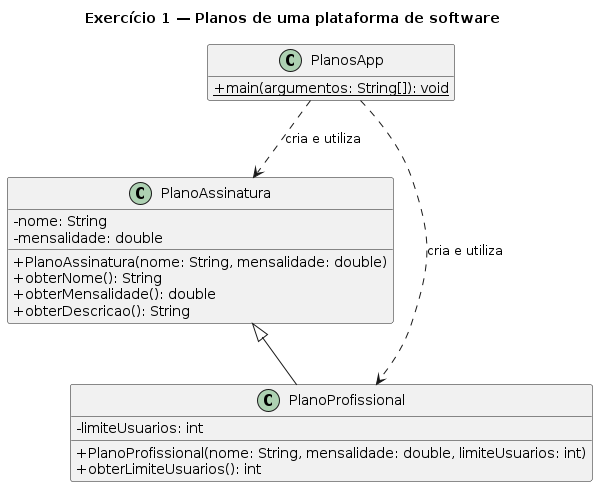
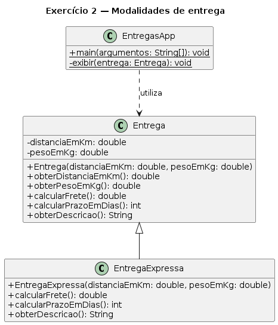
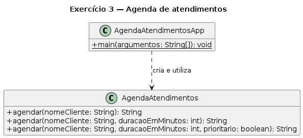
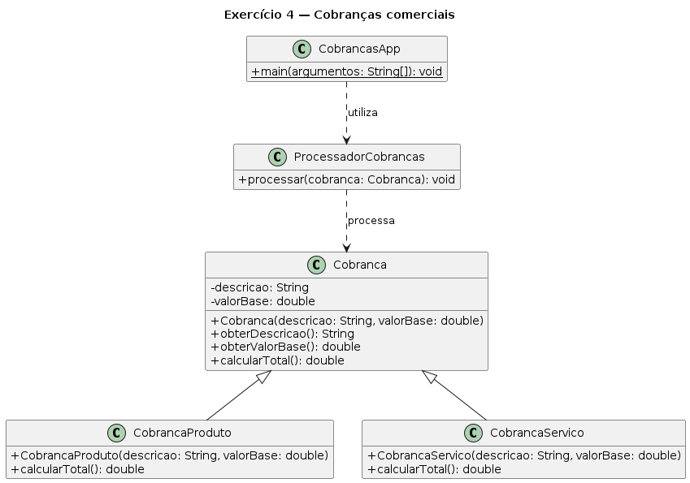
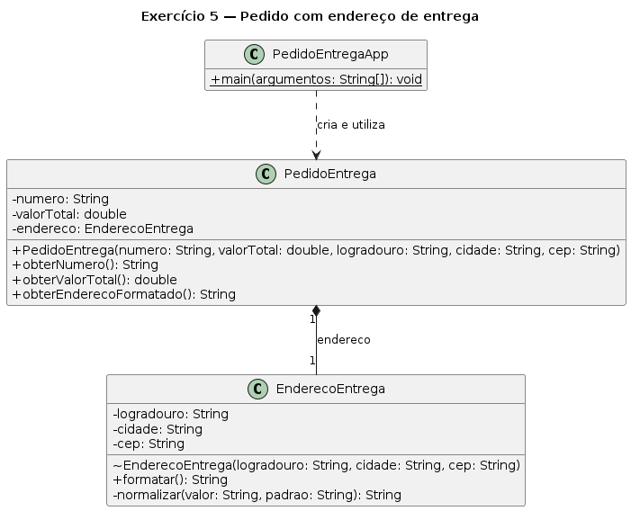
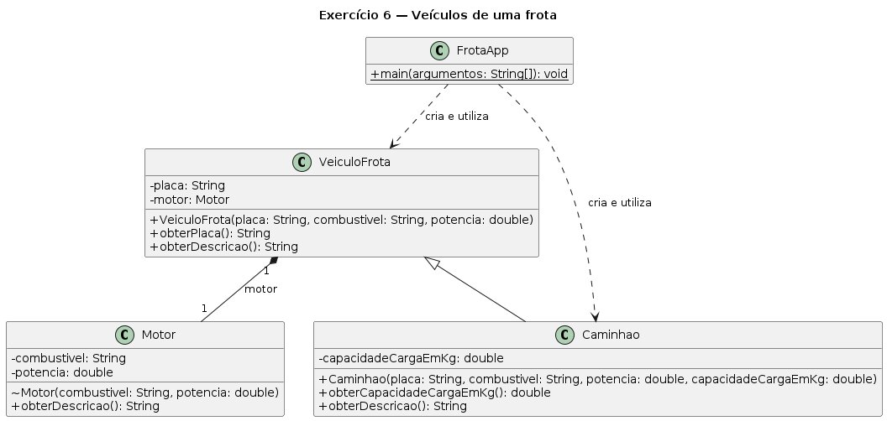
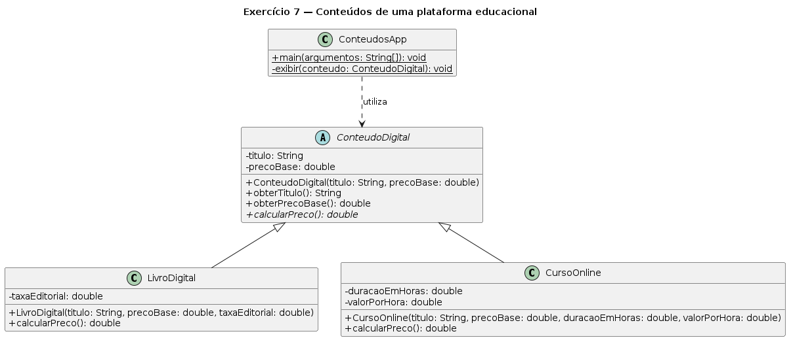
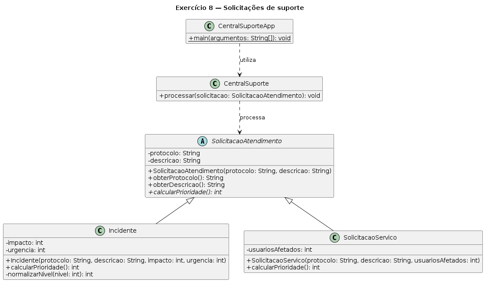
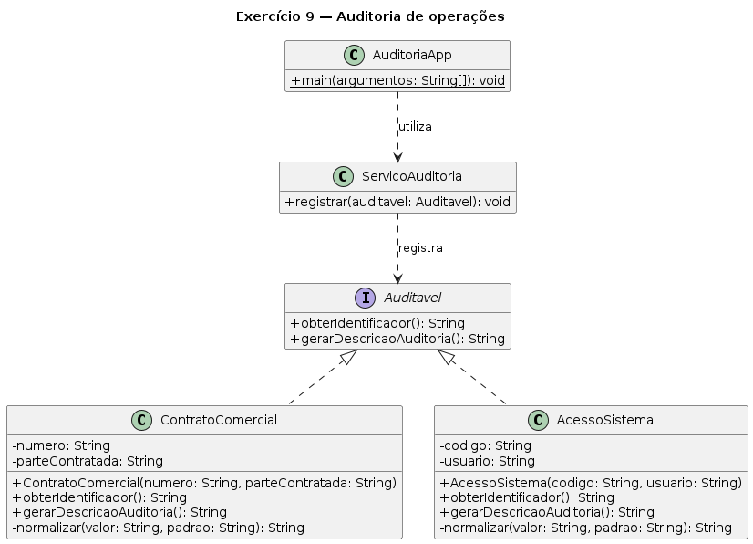
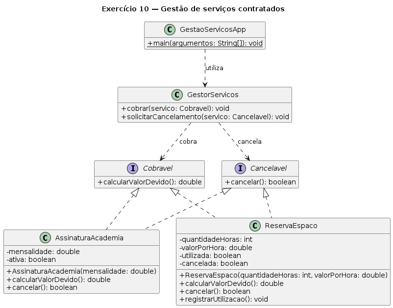

# Prática em sala — herança, polimorfismo e interfaces

Resolva os exercícios para praticar **herança**, **sobrescrita**, **sobrecarga**, **polimorfismo**, **composição**, **classes abstratas** e **interfaces** em Java.

## Orientações

- Leia os requisitos de negócio antes de iniciar a implementação.
- Use o diagrama para identificar nomes, tipos, visibilidades e relacionamentos.
- Mantenha os atributos `private` e preserve as invariantes de cada classe.
- Use herança apenas quando a relação “é um” for válida; use composição para relações “tem um”.
- Utilize `@Override` em toda sobrescrita e `super(...)` para inicializar a parte herdada.
- Não use testes de tipo quando o comportamento puder ser resolvido por polimorfismo.
- Em cada exercício, crie a classe `App` indicada e demonstre os comportamentos solicitados.

## Parte I — herança, sobrescrita e sobrecarga

### 1. Planos de uma plataforma de software

Uma plataforma oferece um plano básico e um plano profissional para seus clientes. O plano profissional mantém as características gerais de uma assinatura, mas também limita a quantidade de usuários da equipe.

#### Requisitos de negócio

- Todo plano deve possuir nome e mensalidade não negativa.
- Para nome não informado, adote `"Plano sem nome"`; para mensalidade negativa, adote zero.
- O plano profissional deve possuir uma quantidade máxima de usuários, normalizada para `1` quando não for positiva.
- A parte comum do plano profissional deve ser inicializada pela classe mais geral.
- Deve ser possível consultar os dados comuns e o limite específico do plano profissional.

#### Requisitos técnicos

Em `PlanosApp`, crie um `PlanoAssinatura` e um `PlanoProfissional` e apresente seus dados.

**Conceitos principais:** herança, relação “é um”, membros herdados e `super(...)`.

### 2. Modalidades de entrega

Uma transportadora oferece entrega convencional e expressa. As duas modalidades compartilham dados básicos, mas calculam prazo e frete de maneiras diferentes.

#### Requisitos de negócio

- Toda entrega deve registrar distância e peso não negativos.
- A entrega convencional cobra `R$ 0.50` por quilômetro mais `R$ 1.00` por quilograma e estima um dia para cada `100 km`, com mínimo de um dia.
- A entrega expressa acrescenta uma taxa fixa de `R$ 20.00` ao frete convencional.
- O prazo expresso corresponde à metade do prazo convencional, arredondado para cima e com mínimo de um dia.
- Cada modalidade deve fornecer sua própria descrição textual.

#### Requisitos técnicos

Em `EntregasApp`, compare frete, prazo e descrição de uma entrega convencional e outra expressa com os mesmos dados.

**Conceitos principais:** sobrescrita, `@Override`, reutilização com `super.metodo()` e despacho dinâmico.

### 3. Agenda de atendimentos

Uma clínica de serviços rápidos permite agendar um atendimento informando diferentes níveis de detalhe, conforme os dados disponíveis no momento do contato.

#### Requisitos de negócio

- Um atendimento pode ser agendado apenas com o nome do cliente.
- Também pode ser agendado com nome e duração estimada.
- Uma terceira opção deve receber nome, duração e indicação de prioridade.
- Nome não informado deve resultar em `"Cliente não identificado"`.
- Duração não positiva deve ser normalizada para `30` minutos.
- Os três caminhos devem produzir um resumo padronizado do agendamento.

#### Requisitos técnicos

Em `AgendaAtendimentosApp`, utilize as três formas de agendamento e apresente os resumos produzidos.

**Conceitos principais:** sobrecarga de métodos, assinaturas e escolha em tempo de compilação.

## Parte II — polimorfismo e composição

### 4. Cobranças comerciais

Uma empresa emite cobranças de produtos e de serviços. Ambas possuem valor-base, mas cada categoria calcula o total segundo sua própria regra.

#### Requisitos de negócio

- Toda cobrança deve possuir uma descrição e um valor-base não negativo.
- Uma cobrança de produto acrescenta `10%` de imposto ao valor-base.
- Uma cobrança de serviço acrescenta `5%` de imposto ao valor-base.
- Um processador deve receber uma referência do tipo geral e apresentar descrição e total sem testar o tipo concreto.
- Novas categorias devem poder redefinir o cálculo sem alterar o processador.

#### Requisitos técnicos

Em `CobrancasApp`, atribua objetos das duas subclasses a referências `Cobranca` e envie-os ao mesmo método de `ProcessadorCobrancas`.

**Conceitos principais:** upcast, polimorfismo, sobrescrita e substituição.

### 5. Pedido com endereço de entrega

Uma loja virtual precisa garantir que cada pedido possua seu próprio endereço de entrega. Nesse modelo, o endereço é criado e controlado pelo pedido.

#### Requisitos de negócio

- Todo pedido deve possuir número, valor total e endereço de entrega.
- Número não informado deve resultar em `"Pedido sem número"`; valor negativo deve ser normalizado para zero.
- O pedido deve receber os dados do endereço e criar internamente o objeto correspondente.
- O endereço deve possuir logradouro, cidade e CEP normalizados quando não informados.
- Código externo deve consultar o endereço formatado, mas não substituir o objeto que pertence ao pedido.

#### Requisitos técnicos

Em `PedidoEntregaApp`, crie dois pedidos e apresente seus respectivos endereços e valores.

**Conceitos principais:** composição, relação “tem um”, ciclo de vida e encapsulamento das partes.

### 6. Veículos de uma frota

Uma empresa de logística registra veículos de sua frota. Todo veículo possui um motor, enquanto um caminhão também é uma especialização de veículo com capacidade de carga.

#### Requisitos de negócio

- Todo veículo deve possuir placa e um motor criado internamente a partir do combustível e da potência informados.
- Dados textuais não informados devem receber descrições padrão; potência negativa deve ser normalizada para zero.
- Um caminhão deve possuir capacidade de carga não negativa.
- Todo veículo deve produzir uma descrição que inclua os dados do motor.
- A descrição do caminhão deve acrescentar sua capacidade de carga.

#### Requisitos técnicos

Em `FrotaApp`, crie um veículo comum e um caminhão, apresente suas descrições e identifique no código as relações “é um” e “tem um”.

**Conceitos principais:** escolha entre herança e composição, `super(...)` e sobrescrita.

## Parte III — classes abstratas

### 7. Conteúdos de uma plataforma educacional

Uma plataforma comercializa livros digitais e cursos on-line. Todo conteúdo possui dados comuns, mas não existe uma regra única de preço aplicável a um conteúdo genérico.

#### Requisitos de negócio

- Todo conteúdo deve possuir título e preço-base não negativo.
- A representação de um conteúdo genérico deve ser incompleta e não pode ser instanciada diretamente.
- Um livro digital custa o preço-base acrescido de uma taxa editorial fixa.
- Um curso on-line custa o preço-base acrescido do valor por hora multiplicado por sua duração.
- Taxas, valores por hora e durações negativas devem ser normalizados para zero.
- Cada conteúdo concreto deve implementar seu próprio cálculo de preço.

#### Requisitos técnicos

Em `ConteudosApp`, crie um livro digital e um curso on-line e apresente seus preços por meio de referências `ConteudoDigital`.

**Conceitos principais:** classe abstrata, método abstrato, subclasses concretas e polimorfismo.

### 8. Solicitações de suporte

Uma central recebe incidentes e solicitações de serviço. Ambos são atendimentos, mas possuem regras diferentes para determinar prioridade.

#### Requisitos de negócio

- Toda solicitação deve possuir protocolo e descrição, mas uma solicitação genérica não deve ser instanciada.
- Um incidente deve considerar impacto e urgência, ambos entre `1` e `5` após normalização.
- Uma solicitação de serviço deve considerar a quantidade de usuários afetados, normalizada para zero quando negativa.
- A prioridade de um incidente corresponde a `impacto × urgencia`.
- A prioridade de uma solicitação de serviço corresponde a `1 + usuariosAfetados / 10`, limitada ao máximo de `25`.
- Cada categoria deve calcular uma pontuação de prioridade segundo seus próprios dados.
- A central deve receber o tipo abstrato e apresentar protocolo, descrição e prioridade sem testar a subclasse.

#### Requisitos técnicos

Em `CentralSuporteApp`, processe um incidente e uma solicitação de serviço pelo mesmo método de `CentralSuporte`.

**Conceitos principais:** abstração, contrato parcial, polimorfismo e princípio da substituição.

## Parte IV — interfaces

### 9. Auditoria de operações

Um sistema corporativo precisa gerar registros de auditoria para objetos de naturezas diferentes, como contratos e acessos ao sistema.

#### Requisitos de negócio

- Todo objeto auditável deve fornecer um identificador e uma descrição para o registro de auditoria.
- Um contrato deve ser identificado por seu número e registrar a parte contratada.
- Um acesso ao sistema deve ser identificado por um código e registrar o usuário.
- Contrato e acesso não pertencem à mesma hierarquia de negócio; compartilham apenas a capacidade de serem auditados.
- Um serviço de auditoria deve processar qualquer objeto que cumpra esse contrato.

#### Requisitos técnicos

Em `AuditoriaApp`, envie um `ContratoComercial` e um `AcessoSistema` ao mesmo método de `ServicoAuditoria` usando referências `Auditavel`.

**Conceitos principais:** interface, `implements`, realização e polimorfismo por contrato.

### 10. Gestão de serviços contratados

Uma empresa administra serviços diferentes, como assinaturas de academia e reservas de espaços de trabalho. Ambos podem ser cobrados e cancelados, embora não pertençam à mesma família de classes.

#### Requisitos de negócio

- Todo serviço cobrável deve calcular o valor devido.
- Todo serviço cancelável deve tentar cancelar e informar se a operação foi realizada.
- Uma assinatura de academia cobra sua mensalidade e só pode ser cancelada uma vez.
- Uma reserva de espaço cobra o número de horas multiplicado pelo valor por hora e só pode ser cancelada antes de sua utilização.
- Um gestor deve cobrar qualquer objeto `Cobravel` e solicitar o cancelamento de qualquer objeto `Cancelavel`.
- O gestor não deve depender das classes concretas.

#### Requisitos técnicos

Em `GestaoServicosApp`, processe cobrança e cancelamento de uma `AssinaturaAcademia` e de uma `ReservaEspaco` por meio dos dois tipos de interface.

**Conceitos principais:** múltiplas interfaces, segregação de capacidades, realização e polimorfismo.
